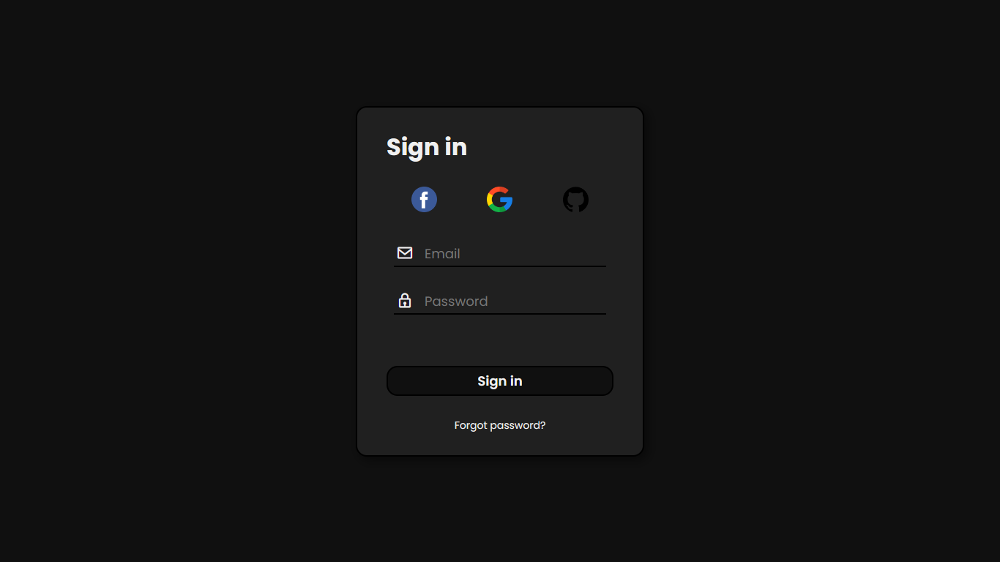
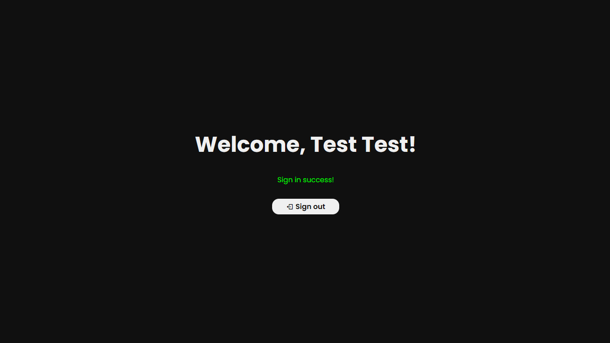

# Login system

### About

The project consists of developing a login system for a web application using PHP, CSS, and HTML technologies. This system will allow users to authenticate themselves to access restricted areas of the application. With a simple and effective approach, the goal is to create an intuitive and secure login experience for users.

### Layout

### Technologies used

<ul>
    <li>PHP</li>
    <li>CSS</li>
    <li>HTML</li>
</ul>

### Author

<b>Marcos Ezequiel</b>

 &nbsp &nbsp &nbsp
 &nbsp &nbsp &nbsp
